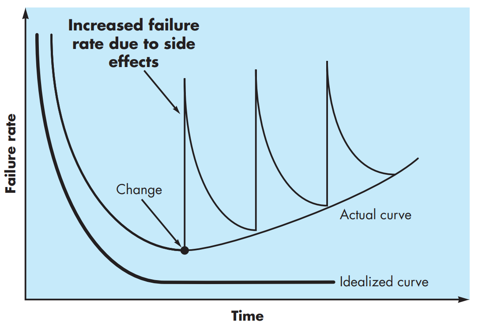
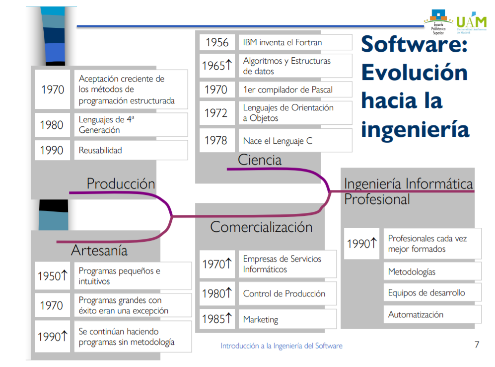
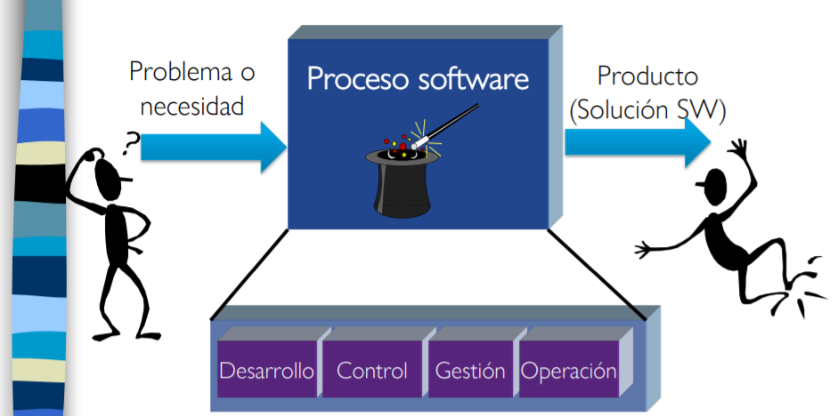
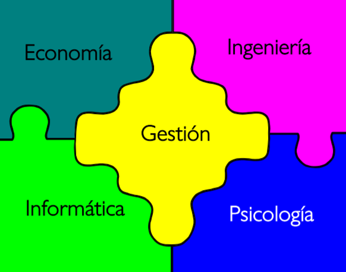

# Introducción a la ingeniería del software

## ¿Qué es el software?

Definimos el software como el conjunto de **programas**, **datos** y **documentación** (manual de usuario...).

Hay que tener en cuenta que es un elemento **lógico** y no físico, y a diferencia del hardware, este es **desarrollado** (no fabricado) lo cuál implica que no haya "*piezas de repuesto*". Aunque parezca que no, el software también se **deteriora**:

El deterioro ocurre debido a que no se mantienen siempre las librerías, fallos de diseño, etc. Otra característica a tener en cuenta es que se **hace a medida**.

## Crisis del Software

La ingeniería del software ha sufrido muchos cambios a lo largo del tiempo:

Tiempo atrás ocurrio una crisis debido a las siguientes **causas**:
* El hardware se hacia más potente.
* Existía una mayor demanda de software.
* No existían métodologías para construir el software.
* Los recursos se usaban inadecuadamente.
* Los sistemas cada vez se volvían más complejos.
* Los desarrolladores proporcionaban muy poca información sobre el software.

Esto provoco los siguientes **síntomas**:
* La **productividad** de los desarrolladores era pésima.
* El software no cumplía con las **espectatívas de los usuarios**.
* El software fallaba mucho haciendolo poco **fiable**.
* La **calidad** es inadecuada.
* Los **costes** no se predecían de forma correcta lo que provocaba sobrecostes de los proyectos.
* El **mantenimiento** del software era costoso.
* Los **plazos** de entrega no se cumplían.
* No se usaban de forma **eficiente** los recursos.

Las **consecuencias** fueron: Baja **productividad** y **calidad**.

La **solución** fue **aplicar la ingeniería del software a la construcción de sistemas informáticos**. Esto fue propuesto en una conferencia de la **OTAN en 1968**.

## Ingeniería del software

### Diferencia entre proyecto y trabajo operativo.

Un **proyecto** requiere un **esfuerzo temporal** aplicado a una idea única y diferenciada (construir una casa), mientras que un **trabajo operativo** requiere efectuar permanentemente tareas que generan un mismo producto (pizzeria, siempre se hacen las mismas pizzas).  

La ingeniería del software se centra en el desarrollo de proyectos y para desarrollarlos hay pasar por el **proceso**:

### Desafios

* Reducir el coste y mejorar la calidad del software.
* Explotar el potencial proporcionado por el hardware.
* Desarrollar y mantener el software manteniendo: Calidad, fiabilidad, facilidad de uso y la imposibilidad del mal uso.

### Definición

Definimos pues la ingeniería del software de la siguiente manera: 

*El establecimiento y uso de principios de ingeniería robustos, orientados a obtener económicamente software que sea fiable y funcione eficientemente sobre máquinas reales - Fritz Bauer*.

*La aproximación sistemática al desarrollo, operación y manteniemiento de software*.

*Software: programas de ordenador, procedimientos, reglas, documentación y datos asociados a un sistema de ordenador - IEEE Standard Glossary of Software Engineering (IEEE, 1983)*.

### Objetivos

Conseguir un producto, conducir un proceso de desarrollo y mantenimiento. **¡UN PROYECTO SOFTWARE NO ES SOLO PROGRAMAR!**. Pero el objetivo general es el de *facilitar al ser humano la realización de alguna tarea*.

### Diferencias con otras ingenierías

* Otras: Construyen instrumentos que imitan, aumentan, ayudan, facilitan o sustituyen capacidades físicas del ser humano.
* Software: Construyen instrumentos que imitan, aumentan, ayudan, facilitan o sustituyen capacidades psíquicas del ser humano.

### Disciplinas

### Fundamentos y técnicas

Existen **métodos** que definen cómo construir el software.

Existen **herramientas** que proporcionan un soporte automático o semiautomático para los métodos.

Existen **procedimientos** que sirven como punto de unión entre los *métodos* y las *herramientas*. Definen la secuencia en la que se aplican los métodos, como usar las herramientas, las entregas que se requieren, controles de seguimiento y calidad, guías para facilitar la labor de gestores y desarrolladores, etc.

### Actividades del Ingeniero Software
* Desarrollo:
  * Decidir que hacer (análisis).
  * Decidir cómo hacerlo (diseño).
  * Hacerlo (codificación).
  * Probar el producto (pruebas).
  * Usar el producto (Entrega/Instalación).
  * Mantener el producto (Mantenimiento).
* Control: Evaluan y aseguran la calidad del software.
* Gestión: 
  * Planifican y estiman los proyectos.
  * Seguimiento de los proyectos.
  * Administración de proyectos.
  * Dirección de proyectos.
* Operación:
  * Entrega (e instalación).
  * Puesta en marcha.
  * Formación a los usuarios.
  * ...

