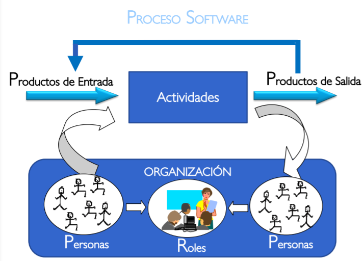
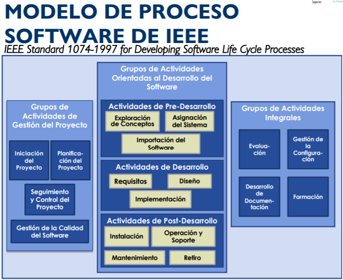
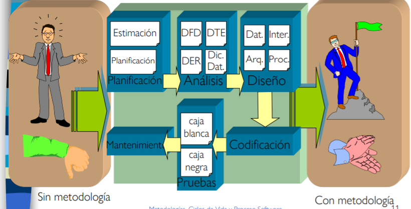
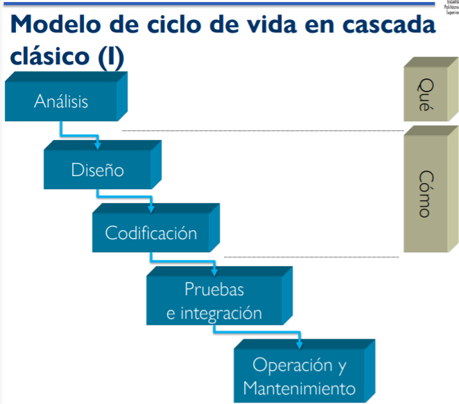
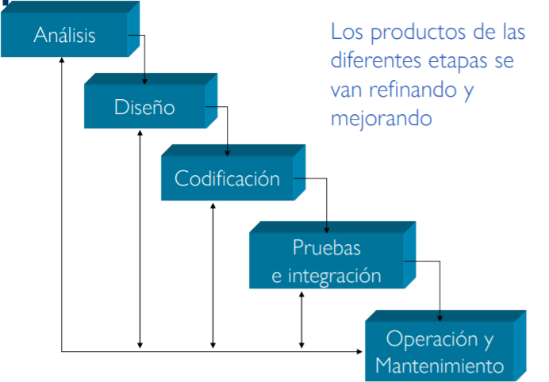
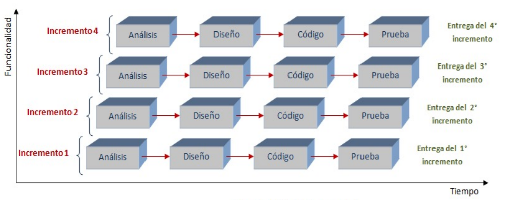
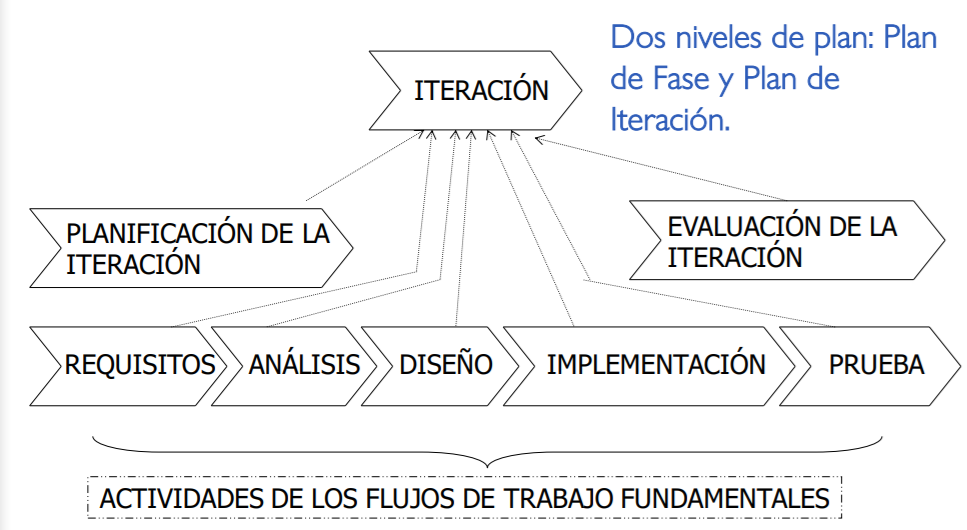

# Metodologías, ciclos de vida y proceso software

## Proceso software
### Definición

*Cuando se trabaja para construir un producto o un sistema, es importante seguir una serie de pasos predecibles - un roadmap que nos permite crear un resultado adecuado y de alta calidad. Ese roadmap es llamado **Proceso software***

*Se considera también un framework para las actividades, acciones y tareas que son requeridas para construir un software de buena calidad*.

## Metodologías
### Definición

*El conjunto de métodos que se utilizan en una determinada actividad con el fin de formalizarla y optimizarla*.

Determinan los pasos a seguir y como realizarlos para finalizar un tarea.

Si aplicamos metodologías a la ingeniería del software: 
* Se **optimiza** el proceso y el producto software.
* Métodos que guían en la planificación y en el desarrollo del software.
* Define qué hacer, cómo y cuándo durante todo el desarrollo y mantenimiento de un proyecto.

## Ciclo de vida
### Definición

*Es el conjunto de fases por las que pasa el sistema que se está desarrollando desde que nace la idea inicial hasta que el software es retirado o remplazado (muere).*

### Funciones

Un ciclo de vida debe:
* Determinar el orden de las fases del proceso software.
* Establecer los criterios de transición para pasar de una fase a la siguiente.
* Definir las entradas y salidas de cada fase.

## Metodología
### Elementos

Un ciclo de vida debe tener los siguientes elementos:
* **Fases**, con sus correspondientes tareas.
* **Productos**, final e intermedios.
* **Procedimientos y herramientas**, apoyo a la realización de cada tarea.
* **Criterios de evaluación**, del proceso y producto para determinar si se han logrado los objetivos.

### Funciones básicas

En todo proyecto lo que se debe hacer es:
1. **definir** el ciclo de vida que más se adecúe a las condiciones y características del desarrollo.
2. **Determinar las fases** dentro del ciclo de vida especificando su orden de ejecución.
3. **Definir los resultados** intermedios y finales.
4. **Proporcionar un conjunto de métdos, herramientas y técnicas** para facilitar la tarea del ingeniero del software y aumentar su productividad.

### Tipos
* **Pesadas o tradicionales**. Las fases están bien definidas, entregas al final, requisitos y planificación bien definidos.
* **Metodologías ágiles**. La interacción con el cliente es continua, se hacen muchas entregas parciales y los ciclos iterativos son más cortos.
* **Modelos centrados en el usuario**. Enfoque e interacción continue con el usuario. Usabilidad y accesibilidad como características de calidad prioritarias.

## Metodologías tradicionales
### Modelo de ciclo de vida en cascada clásico

El proceso de desarrollo de software es una sucesión de etapas que producen prodcutos intermedios. Para que haya éxito deben desarrollarse todas las fases. Las fases continúan hasta que los objetivos se han cumplido. Si se cambia el orden de las fases, producto final será de inferior calidad.

Existen **limitaciones** tales como: *No se permiten las iteraciones*, *los requisitos se congelan* al principio del proyecto y *no se puede visualizar el proyecto hasta el final*. 

### Modelo de refinamiento por pasos

### Proceso unificado
Este proceso permite construir parcialmente el sistema y posteriormente aumentar la funcionalidad del sistema incorporando nuevos requisitos. Esto produce un sistema operacional rápidamente.

* Modelo de ciclo de vida incremental: Se analiza el problema y después se divide en subproblemas, esto implica que el producto software se desarrolla por partes. En cada incremento se agrega más funcionalidad al sistema.
    
    

* Modelo de ciclo de vida iterativo: El refinamiento se hace por pasos aunque, normalmente, se iteran sobre todas las fases cada vez. En cada iteración, se revisa y mejora la calidad del producto.
    
    

## Metodologías métricas

Fue desarrollada en España por el ministerio para la administración pública. Ofrece un marco de trabajo que define una *división del proyecto en fases*, *responsabilidades y funciones de los miembros del equipo*, *conjunto de productos finales*, *conjunto de métodos, procedimientos, técnicas y herramientas aplicables en cada fase*.

## Metodologías ágiles

Ivar Jacobson, describe la agilidad en el software como "*una respuesta efectiva al cambio*". Pero la agilidad no es solo eso. También incluye **estructuras de equipo** y **actitudes** que hacen más fácil la comunicación como la de reflexionar frecuentemente sobre cómo ser más eficaces y mejorar la calidad técnica. Se pone énfasis en la **entrega rápida de software funcional** y se le resta importancia a los productos intermedios de trabajo. Se **adopta al cliente como parte del equipo de desarrollo** y se trabaja para eliminar la actitud de "*nosotros y ellos*".

Entonces, *un proceso software ágil es un proceso que se **adapta** a cambios impredecibles. Esto lo hace de forma **incremental** mediante la retroalimentación con el cliente*.  

Ejemplos de metodologías ágiles son:
* XP (eXtreme Programming)
* KANBAN
* SCRUM