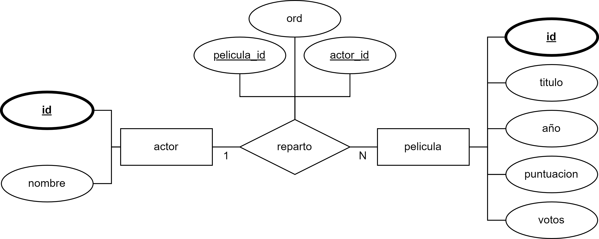
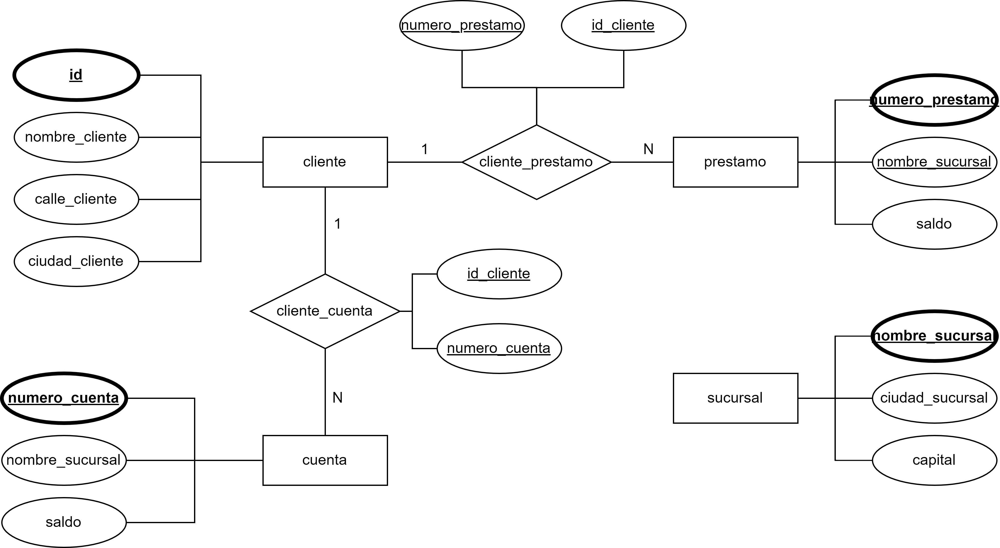

# Diagrama peliculas



# Diagrama banco



### Ejercicio 1

> a) *Crea la BD en PostgreSQL a partir del script proporcionado.*

Instrucctiones en la carpeta SI-1_2/BD

> b) *¿Qué relaciones se establecen entre cada entidad (cardinalidad)?*

Tenemos una cardinalidad 1-N, **cada actor aparece en N películas**.

#### Base de datos banco
Tenemos la relación cliente_cuenta donde **por cada cliente tenemos N cuentas**. 

Tenemos también la relación cliente_prestamo donde **por cada cliente tenemos N prestamos**.

> c) *¿Por qué la tabla REPARTO tiene una clave primaria compuesta por ACTOR_ID y PELICULA_ID?*

No se puede usar una de las 2 foreign-keys como clave primaria ya que **se repetetiría** dentro de la propia relación. En cambio si usamos ambas claves no encontramos repeticiones y podemos hacer única la relación entre una película y un actor.

> d) *¿Por qué el orden de creación de las tablas debe ser: ACTOR o PELICULA, y luego REPARTO?* 

Porque al crear la tabla reparto referenciamos las claves primarias de ACTOR y PELICULA, y no tendría sentido referenciar algo inexistente.

> e) *¿Por qué el orden de borrado de las tablas debe ser: REPARTO, y luego ACTOR o PELICULA?*

Porque si tratamos de borrar ACTOR o PELICULA antes que REPARTO, al no permitir a las foreign keys de ACTOR y PELICULA en la tabla REPARTO sean NULL, estaríamos borrando algo referenciado desde otra tabla y esto provocaría un error ya que el la clave no puede ser NULL.

### Ejercicio 2

a) *Crea una consulta que muestre los nombres de los clientes que tienen un préstamo en la sucursal Perryridge, pero que no tengan una cuenta en dicha sucursal.*

```sql
-- Prestamos cliente
select cl.id, cl.nombre_cliente, pr.numero_prestamo, pr.nombre_sucursal 
from cliente as cl, cliente_prestamo as cl_pr, prestamo as pr
where cl.id = cl_pr.id_cliente AND pr.numero_prestamo = cl_pr.numero_prestamo

-- Cuentas cliente
select cl.id, cl.nombre_cliente, cu.numero_cuenta, cu.nombre_sucursal 
from cliente as cl, cliente_cuenta as cl_cu, cuenta as cu
where cl.id = cl_cu.id_cliente AND cu.numero_cuenta = cl_cu.numero_cuenta

-- Juntamos todo
select t1.t1_nombre_cliente
from 
	(select cl.id as t1_id_cliente, cl.nombre_cliente as t1_nombre_cliente, pr.numero_prestamo, pr.nombre_sucursal as t1_nombre_sucursal
	from cliente as cl, cliente_prestamo as cl_pr, prestamo as pr
	where cl.id = cl_pr.id_cliente AND pr.numero_prestamo = cl_pr.numero_prestamo) as t1,
	(select cl.id as t2_id_cliente, cl.nombre_cliente, cu.numero_cuenta, cu.nombre_sucursal as t2_nombre_sucursal
	from cliente as cl, cliente_cuenta as cl_cu, cuenta as cu
	where cl.id = cl_cu.id_cliente AND cu.numero_cuenta = cl_cu.numero_cuenta) as t2
where t1.t1_id_cliente = t2.t2_id_cliente AND t1.t1_nombre_sucursal = 'Perryridge' AND NOT t2.t2_nombre_sucursal = 'Perryidge';
```

b) *Crea una consulta que muestre, en franjas de 1000 en 1000, el número de prestamos cuyo monto (cantidad) esté en cada una de las franjas.*

```sql
-- Valor prestamo
select cantidad, count(cantidad)
from prestamo
group by cantidad
```
Ni idea, habría que agrupar de alguna forma.

c) *Crea un procedimiento almacenado, llamado busqueda, que dado el nombre de una ciudad muestre los clientes que tienen cuenta en alguna sucursal de dicha ciudad, pero que vivan (los clientes) en otra ciudad distinta.*

```sql
-- Procedimiento almacenado
CREATE OR REPLACE FUNCTION busqueda(ciudad VARCHAR)
RETURNS TABLE (
		nombre_cliente VARCHAR
	) AS $$
BEGIN
	RETURN QUERY select cl.nombre_cliente
	from cliente as cl, cliente_cuenta as cl_cu, cuenta as cu, sucursal as s
	where s.ciudad_sucursal = ciudad and NOT cl.ciudad_cliente = ciudad and cu.nombre_sucursal = s.nombre_sucursal
	and cl.id = cl_cu.id_cliente and cl_cu.numero_cuenta = cu.numero_cuenta;
END;
$$ LANGUAGE plpgsql;

-- Probamos el procedimiento
select * from busqueda('Brooklyn')
```