# Transacciones

Es un concepto orientado a proveer tolerancia a fallos y permitir la concurrencia en sistemas distribuidos (en particular C/S).

_Una transacción es una colección de operaciones de lectura y escritura que están relacionados a nivel lógico._ Los requisitos son:
* Debe ocurrir en su totalidad o no ocurrir en absoluto (**Atomicidad**).
* Si la transacción se ejecuta, los efectos de las operaciones de escritura deben persistir; y si no se completa, la transacción no debe producir ningún efecto.
* Debe implementarse de forma que estos efectos se granticen _incluso si se produce un fallo del sistema_.

La concurrencia de transacciones genera fallos los cuales se pueden solucionar ejecutando las transacciones en "*serie*". En verdad, el objetivo es ejecutar las transacciones "de forma equivalente" a ejecutarlas en serie, pero no necesariamente en serie.

Decimos que una ejecución es correcta si **es en serie** o es **serializable** (que equivaldría a una ejecución en serie).

Se pueden obtener ejecuciones serializables a través de mecanismos de sincronización adecuados, como los **bloqueos (locks)**.

### Ejemplo transacción en serie
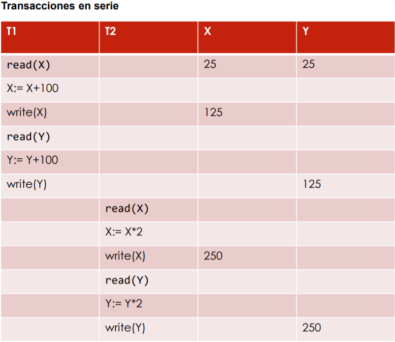

### Ejemplo transacción serializable
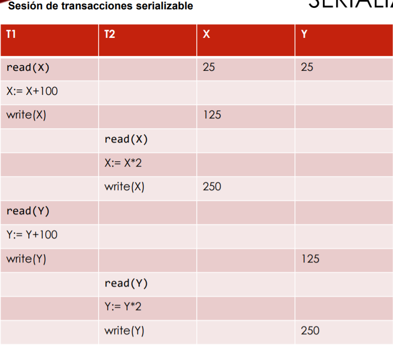

### Ejemplo transacción no serializable
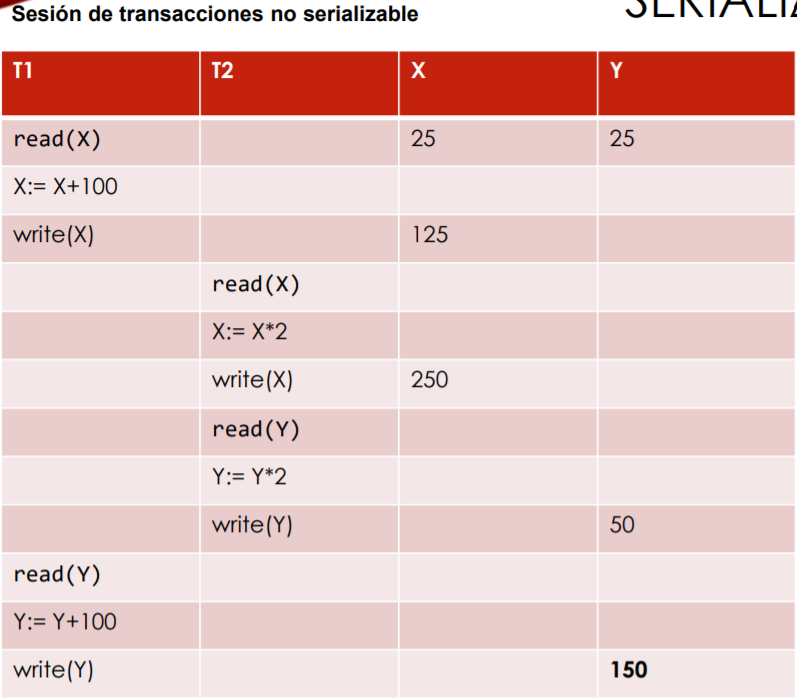

### Problemas asociados a la **ATOMICIDAD**
Otro porblema de las transacciones es la **atomicidad**, lo que significa que *una transacción ocurre en su totalidad o no ocurre*.
Por ejemplo:
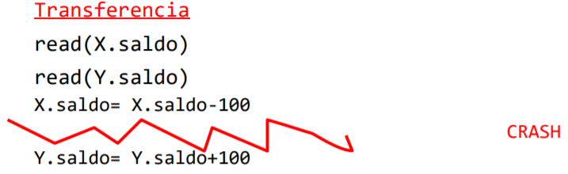
Aquí la escritura a X debería desaparecer, el sistema debería volver al estado anterior de la transferencia.
En clase se ha mencionado que el hecho de mostrar un mensaje de error, sería una prueba de falta de atomicidad, ya que se muestra dicho mensaje.

### Procesos transaccionales
En un proceso transaccional el cliente solicita la ejecución de una transacción (procedimiento remoto especial) al servidor. El servidor garántiza la **atomicidad** de la transacción ademas de la **concurrencia**.

### Invariantes de un sistema
Las **invariantes** son las relaciones que se deben cumplir entre los componentes de un sistema informático. Los invariantes también están definidos sobre el modo en el que el sistema cambia de estado.

### Estados consistentes
El sistema se encuentra en un estado consistente **si satisface todos sus invariantes**. Cualquier cambio puede hacer pasar al sistema por un estado transitorio inconsistente, por ejemplo las transacciónes pasan de un estado consistente a otro consistente a través de uno inconsistente. Si la transación falla el sistema debe quedar en un estado consistente.

## ¿Qué son las transacciones?
Son **conjuntos de acciones que realizan cambios de estado en recursos** (no necesariamente uno). Representan una unidad básica de trabajo, donde en esa unidad básica de trabajo se realizan cambios mediante acciones (*inserción y borrado*, *consultas y actualizaciones*, *cualquier otro proceso coherente con la lógica de la aplicación*).

La transacción **es indivisible**, o se ejecuta por completo o no se ejecuta.

## Propiedades **ACID**
* **A**tomicidad. La transacción es una unidad indivisible de trabajo.
* **C**onsistencia. El sistema debe quedar en un estado consistente, si no se puede realizar la transacción se volverá al estado inicial (*rollback*).
* **I**solation (aislamiento). Una transacción *no se ve afectada por otras que se ejecuten concurrentemente* aunque utilicen los mismos recursos. Los *cambios no deben ser visibles hasta que la transacción finalice*. Es necesario que la transacción *bloquee los recursos que va a utilizar*.
* **D**urabilidad. Sus *efectos son permanentes una vez que ha finalizado* correctamente (commit).

## Modelos de transacciones
### Transacciones planas (*flat transactions*)
No hay llamadas a otras trasacciones y comienzan con un comando tipo begin_transaction.

*Si el proceso fue correcto* se ejecuta el comando tipo commit_transaction haciendo que todo lo realizado por la transacción se valida y es accesible al exterior.

*Si el proceso fue fallido* se ejecuta un comando rollback_transaction en el cual todos los cambios se deshacen.

### Transacciones planas distribuidas
Trabajan con recursos ubicados en diferentes sistemas. Desde el punto de vista de la aplicación que la utiliza es una transacción plana. El monitor de proceso transaccional que la controla debe garantizar que la transacción continúa siendo ACID. En estas transacciones es necesario garantizar la destrucción de las operaciones en todos los sistemas afectados en caso de que algo falle. 

Estas transacciones necesitan un nuevo proceso de validación de la transacción: **Two-Phase Commit**.

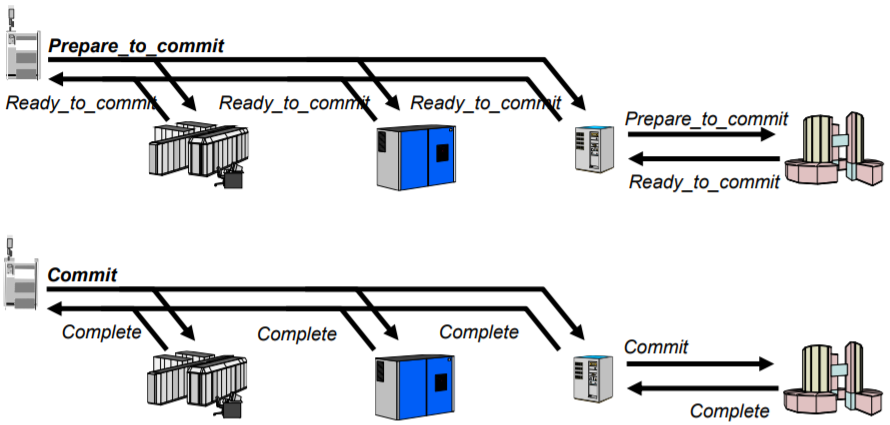

Todas las partes tienen que hacer commit, si una falla se hace rollback.

### Transacciones anidadas
Se hace una llamada a una transacción desde otra (subrutinas)
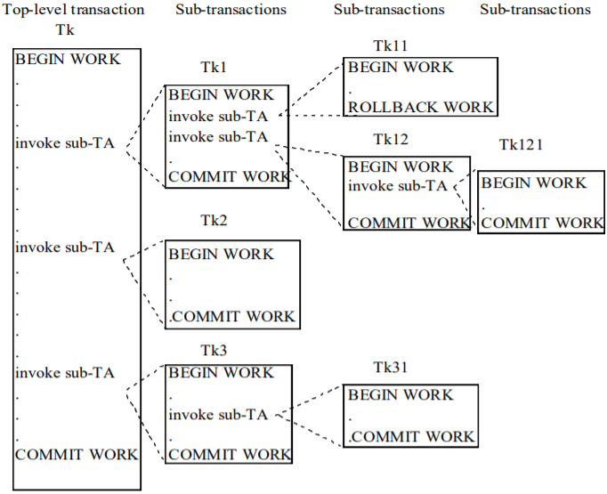
Un dato importante es que el hecho de que falle una subtransacción **no implica que toda la transacción deba cancelarse, dependiendo de la lógica de la transacción, esta sub-transacción puede repetirse**.

### Transacciones con *SAVEPOINTS*
Los SAVEPOINTS evitan el efecto *todo-o-nada*. Si es necesario hacer rollback se puede volver a un punto anterior de la transacción (a un savepoint), pero no es necesario reiniciarla por completo.
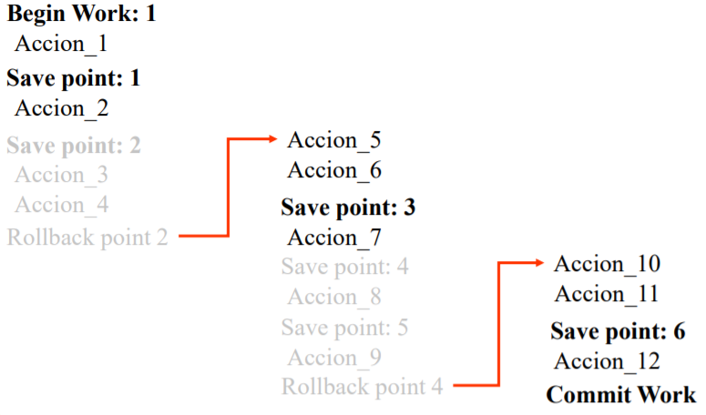

## Aislamiento (*Isolation*). Control de la Concurrencia
Es la propiedad de los sistemas de proceso transaccional por la cual una transacción no se ve afectada por otras que se ejecuten concurrentemente aunque utilicen los mismos recursos.

Leyes de la concurrencia:

**Primera ley**: La ejecución concurrente **no debe causar que los programas de aplicación funcionen incorrectamente**.
Consecuencias:
* Todo programa **debe ver un estado consistente de los recursos** al comienzo de su ejecución.
* Toda modificación del estado consistente de los recursos que vea un programa debe ser motivada por él mismo. 

**Segunda ley**: La ejecución concurrente **no debe tener menor rendimiento o tiempos de respuesta mucho mayores que la ejecución en serie**.
Los algoritmos de control de la concurrencia deben ser sencillos y eficientes.

## Tipos de violaciones del aislamiento
* **Actualización perdida (*lost update*)**: La escritura de una transacción es ignorada por otra que realiza una nueva escritura basada en la versión previa del objeto.

    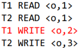

    La actualización en rojo, hecha por T1, se sobreescribe con T2 y se pierde.
  
* **Lectura sucia (*dirty read*)**: Una transación lee un objeto escrito por otra en un estado intermedio.

    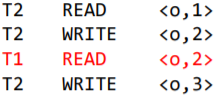

    La lectura en rojo es "mala" ya que T2 no ha terminado de ejecutarse y T1 ha leído un punto intermedio.

* **Lectura no repetible (*unrepeatable read*)**: Una transacción lee un objeto dos veces con valores distintos debido a una actualización intermedia realizada por otra transacción.
  
    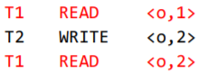

* **Lectura fantasma**: Una transacción lee un dato que no existe al comienzo de esta debido a que otra transacción a insertado dicho valor entre las lecturas.

    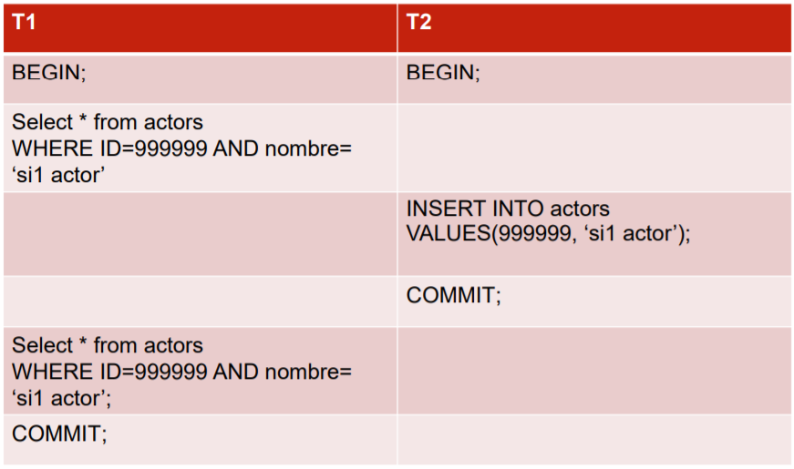

## Bloqueos (Locks)
Acción de una transacción mediante la cual muestra el uso de un objeto. Existen 2 tipos de bloqueos:
* Bloqueo compartido (*shared lock*): No se requiere el uso exclusivo del objeto.
* Bloqueo exclusivo (*exclusive lock*): Se requiere el uso exclusivo del objeto.

A parte, no se pueden pedir ciertos bloqueos si existe ya uno:
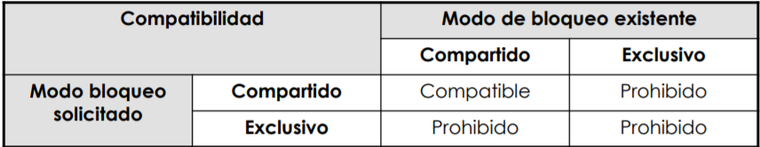

Existen 2 tipos de transacciones en función de como usen sus bloqueos:
* Transacción bien formada: Todas sus lecturas y escrituras están cubiertas por bloqueos (precediddas por un lock del tipo adecuado y no realizado un unlock).
    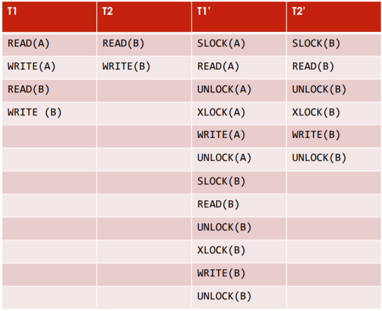

* Transacción de dos fases: Todos los bloqueos preceden a todos los desbloqueos. Tienen 2 fases, crecimiento (se hacen los bloqueos) y contracción (se liberan los bloqueos).
    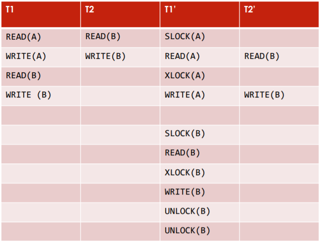
  
Para garantizar el **aislamiento completo** se han de programar las transacción con los siguientes criterios:
* Escribir siempre transacciones bien formadas. Proteger todas las acciones con bloqueos.
* Establecer bloqueos exclusivos en los objetos que se vayan a actualizar.
* Escribir transacciones en dos fases.
* Mantener los bloqueos exclusivos hasta que se realice Commit o el Rollback.

El aislamiento completo **no evita las lecturas fantasma** asociadas a inserciones y borrado de objetos que deberían estar bloqueados.

## Grados de aislamiento
Debido a que el aislamiento completo es costoso muchos fabricantes permiten activar selectivamente el grado de aislamiento deseado para el sistema:
* **0º - Caos**. Las transacciones no sobreescriben datos sucios de transacciones de nivel 1º o superior. ***Perdida de actualizaciones*** - ***Lectura de datos sucios*** - ***Lecturas repetitivas***
* **1º - Lecturas no comprometidas**. No hay pérdida de actualizaciones en el ámbito de la transacción (hasta COMMIT). ***Lectura de datos sucios*** - ***Lecturas repetitivas***
*  **2º - lecturas comprometidas**. No hay pérdida de actualizaciones en el ámbito de la transacción ni lectura de datos sucios. ***Lecturas repetitivas***
*  **3º - lectura repetible**. No hay perdida de actualizaciones ni lectura de datos sucios y hay lecturas repetitivas. Es el aislamiento completo garantizado.

Tabla:
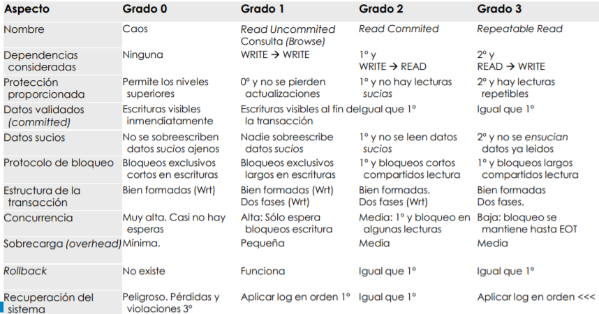

# Resumen tabla (IMPORTANTE PARA EL EXAMEN)
Grado 3: 
- Bien formadas y 2 fases (**escritura** y **lectura**)
- Bloqueos exclusivos ***largos*** en escrituras y ***largos*** compartidos en lectura.

Grado 2:
- Bien formada (**escritura** y **lectura**) 2 fases (**escritura**)
- Bloqueos exclusivos ***largos*** en escrituras y ***cortos*** compartidos en lectura.

Grado 1:
- Bien formadas y 2 fases (**escritura**)
- Bloqueos exclusivos ***largos*** en escrituras.

Grado 0:
- Bien formada (**escritura**)
- Bloqueos exclusivos ***cortos*** en escrituras.

## Interbloqueo (Deadlock)
Situación de bloqueo recíproco de recursos que producen espera ilimitada.

Para solucionar esto podemos **nunca parar** en caso de que se deniegue un bloqueo ejecutar rollback. Intentar de nuevo la transación. También podemos detectar los interbloqueos a través de **timeouts**, se cancelaría la operación tras un tiempo de espera.

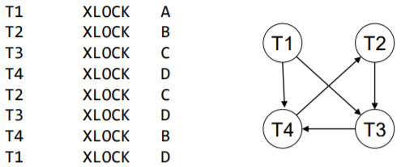