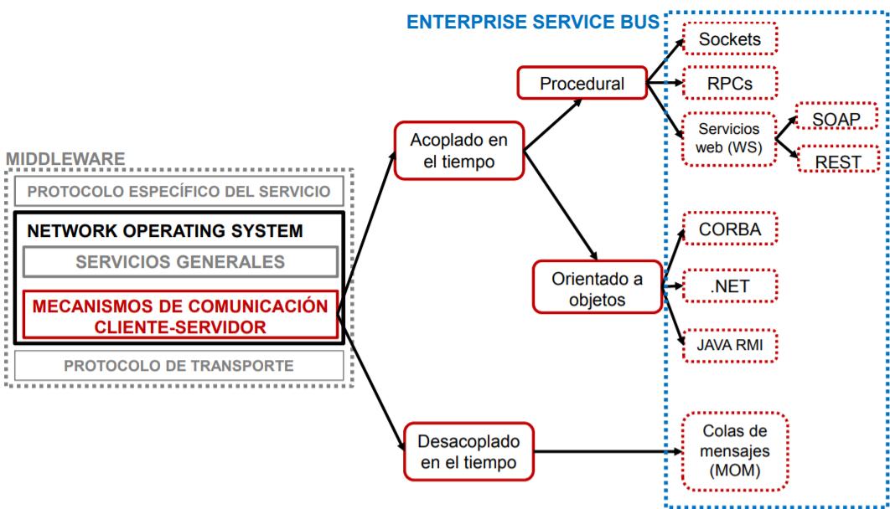
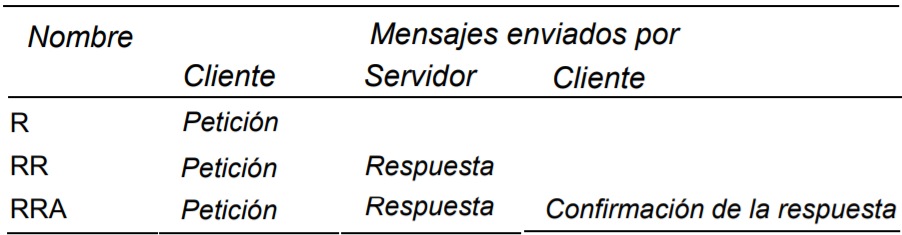
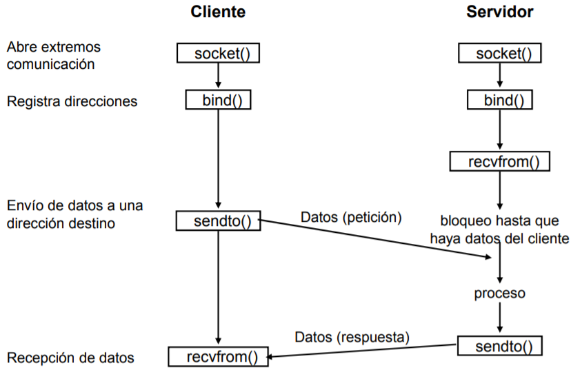
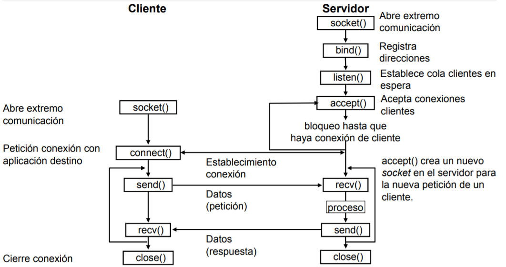
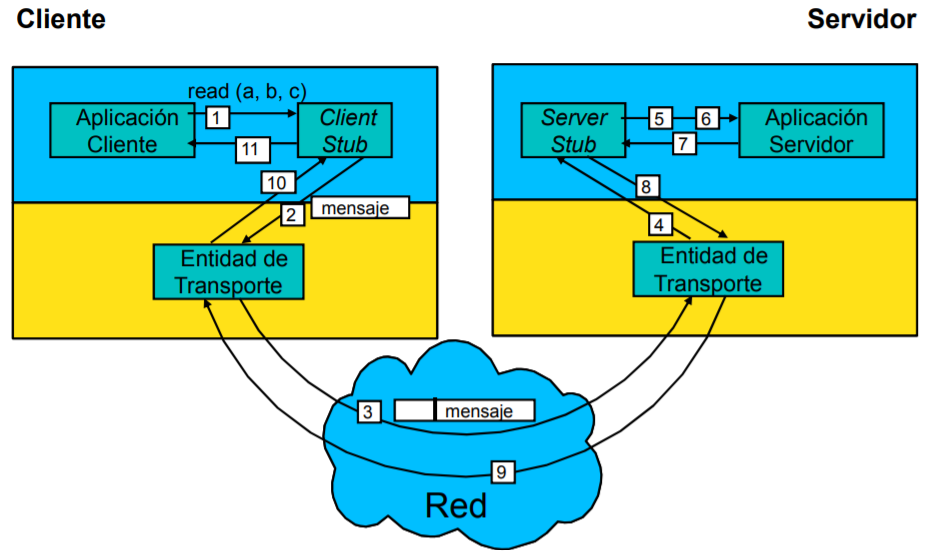
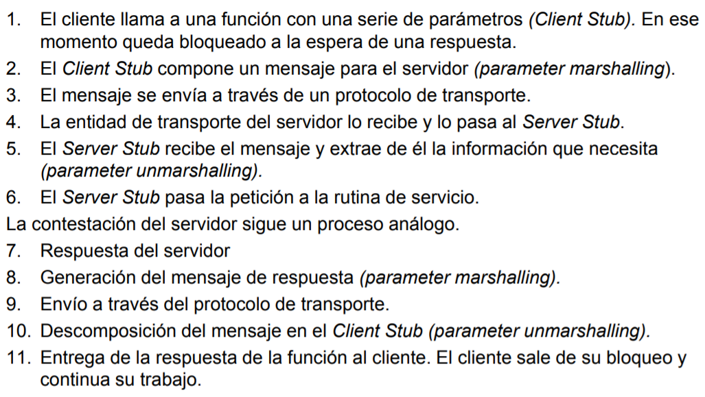
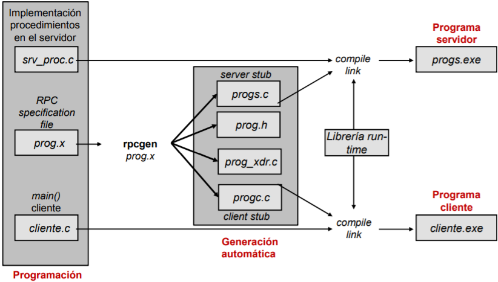
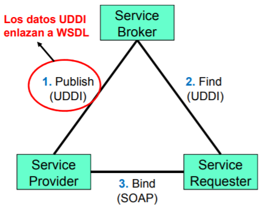

# Tema-1: Middleware

Se define el *middleware* como el conjunto de aplicaciones encargadas de enlazar componentes en un sistema distribuido. Se puede considerar que se divide en 3 capas:
* Protocolos específicos del servicio especiales para distintos tipos de sistemas cliente/servidor.
* Network Operating System, NOS.
* Protocolos de transporte comunes a otras aplicaciones (TCP/IP...).

## NOS. Network Operating System

Es el encargado de proporcionar una apariencia de sistema único a un sistema distribuido. Cuando el cliente realiza una llamada a un servicio (la hace como si fuera local), el NOS:
* Intercepta la llamada.
* Redirige la llamada al servidor.
* Contesta.

El NOS proporciona transparencia a los procesos que lo utilizan mediante las formas definidas por RM-ODP (Open Distributed Processing Reference Model - ISO 10746):
* **De acceso**: Oculta las difrencias en la representación de los datos y llamadas a procedimientos.
* **De ubicación**: Oculta dónde reside cada recurso.
* **De movilidad**: Oculta que un recurso puede moverse a otra ubicación.
* **De reubicación**: Oculta que un recurso puede moverse a otra ubicación mientras está siendo utilizado.
* **De persistencia**: Oculta la activación y desactivación de objetos desde un soporte de datos permanente.
* **De replicación**: Oculta el uso de múltiples ejemplares de cada recurso para aumentar fiabilidad y prestaciones.
* **Frente a fallos**: Oculta el fallo y recuperación de un recurso.
* **De concurrencia o de transacción**: Oculta el uso de un recurso de modo concurrente por varios procesos.

Otras características deseables son:
* **De prestaciones**: Reconfigurar el sistema para mejorar sus prestaciones según la carga de trabajo.
* **De escalado**: Expansión del sistema en tamaño sin cambiar su estructura o los algoritmos de la aplicación.
* **Espacio de nombres**: Las convenciones de los nombres de los recursos deben ser iguales, independientemente del sistema que los soporte.
* **Conexión**: Un único usuario y contraseña para todo el sistema. Sólo se debe introducir una vez.
* **Tiempo**: El mismo en todo el sistema. Los relojes de todos los elementos del sistema cliente/servidor deben estar sincronizados.
* **Administración**: Un único sistema de gestión de todos los recursos.
* **Protocolos**: Idéntica interfaz de programación para todos los protocolos de transporte.

Otro inconveniente dentro de los sistemas distribuidos son los propios datos, ya que estos se representan en una forma u otra dependiendo del ordenador, su hardware o su SO. Para evitar el problema del formato de representación de datos, tanto el cliente como el servidor deben ponerse previamente de acuerdo en el formato en que se van a intercambiar los datos (idioma común). Hay 3 alternativas sobre el acuerdo a tomar:
1. **Mecanismo de representación de datos independiente de la plataforma**. Antes de la transmisión los datos se convierten a un formato genérico conocido por todos los precesos (idioma común). Existen 2 procesos en relación a este formato:
     * **Marshalling**: El emisor convierte los datos del formato local al formato común.
     * **Unmarshalling**: El receptor convierte el formato común al formato local de su arquitectura.
2. Para la comunicación entre dos ordenadores con arquitectura común, el paso anterior puede omitirse. Esto requiere que antes de la transmisión de los parámetros, los dos extremos negocien si se requiere pasar los datos a un formato genérico o no.
3. Transmisión de los datos en su formato nativo junto con un identificador del tipo de arquitectura subyacente. El receptor decide si es necesario convertir los datos recibidos o no.

En el caso 1, se ha hablado de **un mecanismo de representación de los datos independiente de la plataforma**, existen distintos:
* **Sistemas propios de aplicación o protocolo**. Ejemplos: *External Data Representation (XDR)*, *Network Data Representation (NDR)*.
* **Estándar Abstract Syntax Notation 1 (ASN.1)**. Orientado a optimizar la compactación de la información y su codificación y decodificación por los nodos de la red.
* **XML**. Orientado a la interpretación humana de la inforamción.
* **JSON**. Formato legible y ligero para el intercambio de datos.
* **Codificación de caracteres**: Ejemplo, *UTF-8*.

## Mecanismos de comunicación cliente-servidor


Tenemos 2 modelos de interacción:
* **Síncrono**: El cliente envía una consulta y espera hasta que se le devuelven los resultados.
* **Asíncrono**: El cliente continúa su proceso tras realizar una consulta. Los resultados se envína cuando están disponibles.

También tenemos protocolos de intercambio:



## APIs directas
Uso directo a una interfaz de programación para acceder a los servicios de comunicaciones. Habitualmente los servicios son de nivel de transporte o sesión, las comunicaciones son orientadas a conexión (datagramas), la ubicación en los extremos no es transparente para el programa ("*close to the wire*").

## Sockets
Son incluidos como medio de programación de comunicaciones en el Unix de Berkeley (BSD) versión 4.2 en 1981. Son también adaptados a AT&T Unix como *Transport Level Interface*.

Establecen un camino de comunicación entre:
* Dirección IP origen, Puerto IP origen.
* Dirección IP destino, Puerto IP destino.
* Usan un protocolo (TCP, UDP...).

### Comunicación NO orientada a conexión



### Comunicación orientada a conexión



## Remote Procedure Calls (RPC)

Es la ejecución de un servicio en el cliente la cual se realiza del mismo modo que una llamada a una función local:
* El cliente llama a una función.
* Pasa los parámetros.
* Su proceso se detiene hasta que la ejecución de la función finaliza.
* Recibe la respuesta de la función a través de parámetros y resultado de la función.





### Problemas transparencia

Los principales problemas son:
* **Paso de parámetros**: No es posible pasar parámetros por referencia.
* **Asociación llamada/servidor/proceso en el servidor (*Binding*)**.
* **Semántica de la llamada**. 
  * Tras un *Time Out* no se sabe si la llamada se ha ejecutado o no.
  * Distintos tipos de operaciones:
    * *Idempotentes*: Se pueden ejecutar cualquier número de veces.
    * *No idempotentes*: El resultado varía con el número de veces que se ejecuten.
  * Según las operaciones, la estrategia en las llamadas RPC puede ser distinta:
    * Ejecución exactamente una vez.
    * Ejecución como máximo una vez.
    * Ejecución al menos una vez.
* **Representación de los distintos tipos de datos**.
* **Rendimiento de las llamadas**.
* **Seguridad**.

### RPC en redes IP
Se utiliza como protocolo TCP o UDP. Existe un problema, y es conocer el puerto en el que se escucha el servidor. Para solucionar esto:
1. El programa servidor se registra en *Port Mapper*.
2. El programa cliente pregunta a *Port Mapper* por el puerto.
3. Se establece la conexión en el puerto.

## SUN RPC

Está implementado en Unix y windows, ahora se llama ONC RPC (Open Network Computing Remote Procedure Call). Tiene 3 componentes:
1. **Lenguaje de definición de tipos de datos (eXternal Data Representation, *XDR*)**. Es un **lenguaje de definición de datos** que permite definir los datos a intercambiar entre el cliente y el servidor RPC de forma transparente al ordenador y lenguaje en que se trabaje.
2. **Lenguaje de especificación de RPC**. Contiene declaraciones XDR y especificación de programas, versiones y procedimientos. El compilador es *rpcgen*, el cual genera *client stub*, *server stub* y un *fichero de interfaz* (include).
3. **Librería de implementación**.



El **paso de parametros** se puede hacer de las siguientes formas:
* Los **RPCs** en general soportan *múltiples parámetros* los cuales pueden ser de entrada y de salida. Se realiza el *Parameter Marshalling / Demarshalling*.
* Los **RPCs SUN** aceptan un *único parámetro de entrada* (parámetro del RPC) y *un único parámetro de salida*, estos pueden ser estructuras. El *parámetro de entrada es constante*. El proceso de *Marshalling / Demarshalling* es mínimo en el RPC ya que es responsabilidad del usuario.
* Los **Apollo RPC (DEC)** reciben *múltiples parámetros*, los cuales tienen indicado si son de entrada y salida. 

## Servicios Web (Web Services, WS): WS basados en SOAP

Concebido como un nuevo modelo de uso de la Web (Application Centric Web). 

Las transacciones son iniciadas automáticamente por un programa, no necesariamente utilizando un navegador.

Se pueden describir, publicar, descubrir e invocar dinámicamente en un entorno distribuido.

El Middleware está sobre internet, este tiene funcionalidad para *publicar y descubrir* servicios dinámicamente y *ejecutar* servicios siguiendo un modelo RPCs. Los servicios son *multi-tier* (un servidor puede a su vez solicitar servicios).

### Componentes



* El **provider** es quien *ejecuta* los servicios solicitados y *publica la disponibilidad* a través del registrador.
* El **registrador de servicios (service broker)** da soporte para la publicación y localización de servicios.
* El **Cliente (Service Requester)** *busca* los servicios a traves del service broker y *enlaza* con los servicios del service provider.

## SOAP (Service Oriented Architecture Protocol)

Es un protocolo basado en XML para el intercambio de información entre ordenadores. Es independiente de la plataforma y del lenguaje de programación.

La estructura de un mensaje SOAP es la siguiente:
- **Sobre** (SOAP-ENV:Envelope).
- **Cabecera** (opcional) (SOAP-ENV:Header). Contiene información general a nivel de aplicación.
- **Cuerpo** (SOAP-ENV: Body): Contiene la petición o la respuesta. Puede incluir elementos genéricos de información de errores (SOAP-ENV:Fault).

### Web Services Description Language, WSDL

Lenguaje XML para especificar la interfaz pública de un servicio Web.
Estructura de una declaración WSDL:
* \<definitions>: Elemento raíz que contiene el resto. Define su nombre y los espacios de nombres que utiliza.
* \<types>: Tipos de datos utilizados entre cliente y servidor. Usa W3C XML Schema (XSD) por defecto.
* \<message>: Declaraciones de mensajes empleados para peticiones y respuestas y los elementos que los forman.
* \<portType>: Operaciones soportadas y encadenamiento de mensajes que implica su ejecución.
* \<binding>: Modo en que los mensajes se transmiten sobre un protocolo de RPC, con extensiones específicas para SOAP.
* \<service>: Contiene la información de la dirección en la que se localiza el servicio.

### Ventajas e inconvenientes *Web Services basados en SOAP*

## Representational State Transfer (REST)
Es un modelo de arquitectura para sistemas hipermedia distribuidos como la World Wide Web y definido por el W3C.

**REST es una arquitectura**, no un estándar. Incluye el uso de estándares como HTTP, XML, MIME, etc. Este es el modelo de interacción habitual con la WWW. Los sistemas que siguen los principios REST se llaman con frecuencia *RESTful*.

El sistema se compone de **recursos**: 
Un recurso *es cualquier elemento que debe ser accedido* en el sistema distribuido. Los recursos *se acceden a través de un identificador* global (URI). Cada acceso a un recurso *se contesta con una Representación* del mismo. Existen diferentes *modos de ver el recurso*, en función de la consulta o el estado. En la representación del recurso *se pueden incluir enlaces* a representaciones relacionadas o con
mayor nivel de detalle.

*La recepción de la representación provoca un cambio de estado* en el elemento que la recibe.

El *acceso a los recursos se realiza mediante una interfaz uniforme*, **basada en el intercambio de mensajes HTTP**, con los métodos estándar GET, PUT, DELETE, POST.

### Diferencias entre el WS SOAP vs WS REST

**Ventajas REST**:
* Ligero. No necesariamente sobre XML.
* Fácil de implementar.
* Es posible navegar de un recurso REST a muchos otros, simplemente siguiendo enlaces sin requerir el uso de registros u otra infraestructura adicional.

**Ventajas de SOAP**:
* Fácil de consumir ya que es un estándar.
* Rígido: tipado fuerte, sigue un contrato.
* Herramientas de desarrollo generación automática de stubs, etc.

## Sistemas de objetos distribuidos
Se realizan llamadas a métodos para solicitar la ejecución de acciones por parte de un objeto. Del mismo modo se realizan comunicaciones entre objetos remotos mediante invocación de métodos remotos (*Remote Method Invocation, RMI*) aunque es necesario un middleware para realizar la interconexión.

Para **implementar un RMI** son necesarios:
* **Módulo de comunicación**: Es el responsable de comunicar sistemas remotos y de la semántica adecuada de la llamada.
* **Módulo de referencia remota**: Es el responsable de traducir las referencias entre objetos locales y objetos remotos.
* **Objeto Proxy**: Hace transparente la invocación al objeto remoto para el cliente.
* **Distribuidor**: Determina el método del objeto remoto que se debe ejecutar.
* **Esqueleto**: Realiza el parameter unmarshalling y marshalling para ejecutar el método elegido y devolver resultados.

Plataformas de objetos distribuidos: *Object Management Architecture (OMA)*, *.Net Remoting*, *Java Remote Method Invocation, RMI*.

### Modelo de objetos (CORBA)

Un objeto CORBA es un **objeto virtual**, es decir, no tiene existencia por sí mismo si no hay detrás un objeto en un determinado lenguaje de programación que lo soporte.
* Ofrece un servicio.
* Se define mediante el IDL (Interface Description Language), pero puede estar implementado en *cualquier lenguaje*.
* Se identifica de manera única mediante su referencia a un objeto remoto.
* Existe transparencia de acceso. Se invocan métodos como: ```objeto.metodo(parametros)```

La comunicación puede ser *síncrona*, *asíncrona* y *one-way (sin respuesta)*

El **Object Management Architecture (OMA)** tiene diferentes elementos:
* **Object Request Broker, ORB**. Bus de comunicación entre objetos.
* **Common Object Services**. Componentes que implementan servicios *al nivel del sistema*.
* **Common Facilities**. Colecciones de componentes, con funciones de tipo general, pero orientados a aplicaciones finales en vez de al sistema.
* **Domain Interfaces**. Conjunto de servicios, similar a los anteriores, pero de tipo vertical: Específicos para cada área de aplicaciones.
* **Application Interfaces**. Interfaces específicas de aplicaciones concretas.

El **Object Request Broker (ORB)**, es el elemento central y principal de esta arquitectura. Es un **bus de objetos** que *permite la comunicación entre ellos de forma transparente*. A parte, es un Middleware avanzado:
* Permite llamadas estáticas y dinámicas a objetos. Se incluye el descubrimiento dinámico de objetos.
* Lengauje de descripción de interfaces independiente del lenguaje de programación (IDL).
* Enlace directo de aplicaciones escritas en múltiples lenguajes de alto nivel.
* Sistema auto-descrito (**introspección**). Genera meta-información sobre todo el sistema, consultable dinámicamente (repositorio de interfaces).
* Transparencia de ubicación y de acceso.
* Soporte de seguridad y autenticación.
* Soporte de transacciones.
* Polimorfismo en la ejecución de funciones asociadas a un mismo mensaje.

Existen protocolos **inter-ORB**:
* ***General Inter-ORB PROTOCOL (GIOP)***: Formatos de mensajes y representación de datos común para todos los ORBs. Existe un estándar para la representación de los datos (**Common Data Representation (CDR)**). Por último, los objetos son interoperables (**Interoperable Object References (IOR)**).
* ***Internet Inter-ORB Protocol (IIOP)***: Especifica el intercambio de mensajes GIOP sobre protocolo de transporte **TCP/IP**.
* ***Enviroment-Specific Inter-ORB Protocols (ESIOP)***: Interconexión de ORBs a través de Middlewares específicos.

Los **Interface Definition Language (IDL)**, son similares a RPC XDL y a DCE IDL. Se definen interfaces independientemente del lenguaje de programación.

Se puede **compilar** el IDL generando: *Stubs cliente*, *Stubs de servidor* (CORBA los denomina esqueletos) y *ficheros de definiciones*.

También, existen **traductores** de IDL, que generan código fuente del lenguaje elegido.


CORBA tiene **dos modos** básics de funcionamiento del cliente:
* **Invocación estática**: El cliente conoce la estructura del servidor, los métodos... y las llamadas se resuelven en *tiempo de compilación*.
* **Invocación dinámica**: Se descubren objetos en tiempo de ejecución, las llamadas se generan de forma dinámica, el cliente consulta el repositoria de interfaces.