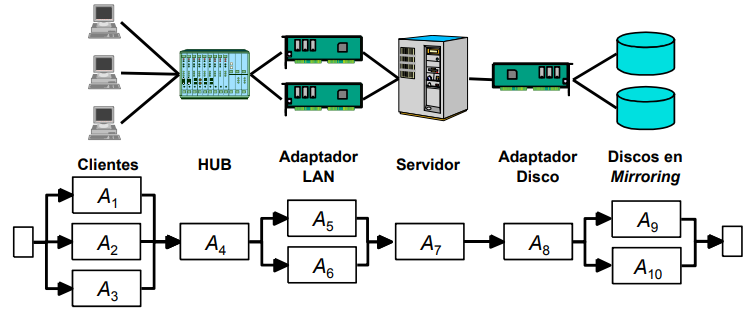
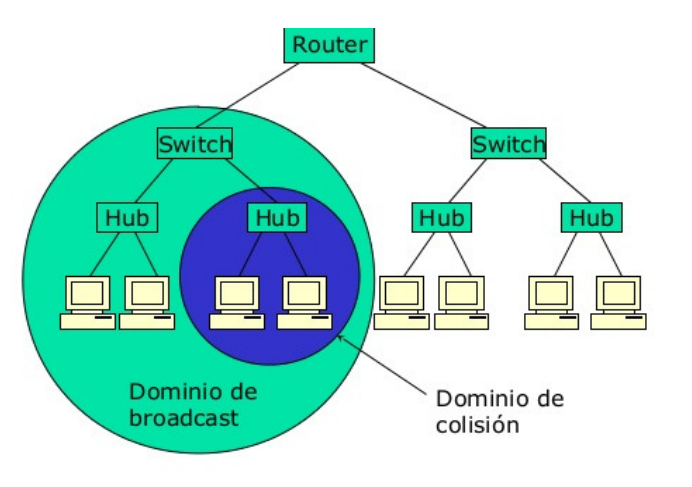

# Disponibilidad

## Introducción

La disponibilidad de un sistema es la probabilidad de que un sistema se encuentre operativo en un instante de tiempo arbitrario.

Un sistema puede estar no disponible debido a:
* **Paradas no planificadas** (Interrupciones, fallos humanos, fallos hardware...).
* **Paradas planificadas** (rearranques, copias de seguridad, instalación de parches...).

El sistema ideal tendría **alta disponibilidad** y **operaría de forma continua**.

### Definiciones de la disponibilidad

* **Fiabilidad (*Reliability*)**: Probabilidad de que un componente o sistema continúe funcionando.
* **Elasticidad o resilencia (*Resiliency*)**: Capacidad de un sistema para adaptarse a condiciones externas imprevistas
* **Mantenibilidad (*Serviceability*)**: Es la probabilidad de realizar una reparación satisfactoria en un tiempo determinado.
* **Sistemas tolerantes a fallos (*Fault-Tolerant Systems*)**: Sistemas que contienen componentes hardware dobles de modo que el fallo de uno de ellos no suspende su operación.
* **Clusters de alta disponibilidad (*High Availability Clusters*)**: Conjunto de nodos de servicio que comparten conexiones externas y gestionados por un software especial que permite proporcionar servicio sin interrupciones.
* **Clusters de alto rendimiento (*High Performance clusters or parallel computing clusters*)**: Conjunto de nodos de servicio que comparte una misma carga de trabajo.
* **Recuperación ante desastres (*Disaster Recovery*)**: Capacidad de una instalación de recuperar la operatividad tras un evento de gran magnitud

### Estimación de la disponibilidad

$A={\frac{T_{operativo}}{T_{operativo} + T_{inactivo}}}$

Esta medida puede dar una indeterminación con respecto a la escala.

Se usan las siguientes métricas:
* Tiempo medio entre fallos (*Mean Time Between Failures, MTBF*).
* Tiempo medio hasta el fallo (*Mean Time To Failure, MTTF*).
* Tiempo medio de reparación/recuperación (*Mean Time To Repair/Restore, MTTR*).

$A={\frac{MTTF}{MTBF}}={\frac{MTTF}{MTTF+MTTR}}$

### Fallos en programas

Dos posibles situaciones:
* **Programas que no son reparados cuando se encuentra un defecto**. Los problemas se resuelven en nuevas versiones.
* **Programas cuyos defectos se corrigen conforme se encuentran**.  Los defectos se van encontrando en el transcurso de la vida del programa.

### Tiempo de reparación (Mantenibilidad)

En este tiempo se incluye:
* El tiempo para descubrir un fallo.
* El tiempo de diagnóstico.
* El tiempo de conseguir las piezas para la reparación.
* El tiempo para lograr acceder a las piezas a sustituir.
* El tiempo de remplazo de dichas piezas.
* El tiempo en poner el sistema operativo de nuevo.
* El tiempo de verificaciñon de que el sistema funciona conforme a sus especificaciones.
* El tiempo de cierre del sistema, y vuelta a la operación normal.

### Distribución componentes

* **Serie**: Si los componentes están en serie, *un fallo en cualquiera de ellos hace que falle el sistema global*.
* **Paralelo**: Un sistema con $N$ componentes redundantes *depende para su funcionamiento correcto del funcionamiento de uno solo* de dichos componentes.

### Mejoras disponibilidad

$A={\frac{MTTF}{1+MTTR/MTTF}}$

Se puede mejorar la disponibilidad:

* **Aumentando el MTTF**: 
  * **Mejorando la calidad** de los equipos. 
  * Introduciendo **elementos redundantes**.
* **Disminuyendo el MTTR**:
  * Disminuyendo el tiempo de latencia ante el fallo.
  * Disminuyendo el tiempo para aislarla.
  * Disminuyendo el tiempo para corregirla.
  * Disminuyendo el tiempo para verificar el correcto funcionamiento.

La disponibilidad de la cadena de procesamiento es menor que la disponibilidad del menor de sus elementos.

Los puntos más críticos de la cadena de procesamiento son aquellos en los que en caso de producirse un se produce la caída del servicio. Ese punto se denomina ***Single Point Of Failure, SPOF***.

En todos los sistemas es necesario considerar dos procesos:
* **Fail-over**: Cómo actuar cuando se produce un fallo para mantener el servicio.
* **Fail-back**: Cómo actuar para recuperar la sistuación normal cuando el fallo se resuelve.

## Arquitecturas para aumentar la disponibilidad

### Tipos de redundancia

Según el **estado** de cada elemento del cluster:
* **Activo-Activo (AA)**: Todos los componentes del cluster se encuentran activos.
* **Activo-Stand by (AS)**: Un componente del cluster se encuentra activo. El resto se encuentran disponibles para su activación casi instantánea.
* **Activo-Pasivo (AP)**: Un componente del cluser se encuetra activo. El resto se pueden activar bajo demanda después de un intervalo determinado de tiempo.

Según el **reparto de carga** entre los elementos del cluster:
* **Reparto dinámico de la carga (D)**, según las necesidades de proceso de cada momento.
* **Reparto estático de la carga (E)**.

Según el **tratamiento de las conexiones activas**:
* **Continuidad** de las sesiones activas tras un fallo (C).
* **Interrupción** de las sesiones activas tras un fallo (I).

### Redundancia en los sistemas de comunicaciones.

Hay que estudiar la redundancia en las redes locales *LAN (Local Area Network)* y en las redes de área extendida *WAN (Wide Area Networks)*.

### Dominios de tráfico

* Dominio de **colisión**: Es un segmento físico de una red donde es posible que las tramas puedan "colisionar" (interferir con otros).
* Dominio de **difusión**: Es el área lógica en una red en la que cualquier ordenador conectada a la red puede transmitir directamente a cualquier otra computadora en el dominio sin precisar de ningún encaminamiento, dado dado que comparten la misma subred, dirección de puerta de enlace y están en la misma red de área local (LAN) o virtual (VLAN).

Los dispositivos como los hubs (*capa 1*) **extienden** los dominios de colisión. Los dispositivos como los switch/conmutadores (*capa 2*) **segmentan** los dominios de colisión. Los dispositivos como los routers (*capa 3*) segmentan los dominios de colisión y difusión.

### EtherChannels

Los EtherChannels son grupos de enlaces Ethernet que se comportan como un único enlace. Se comparte la dirección MAC y todos los puertos están activos simultáneamente.

Como **ventajas** tenemos que se resuelven los fallos más rapido y se aumenta el ancho de banda de las conexiones.

## Open Shortest Path First, OSPF

Protocolo de encaminamiento dinámico eficaz y ampliamente utilizado en redes IP autónomas. Se basa en el conocimiento de la información de estado de los enlaces de toda la red. Con esa información se construye el árbol de caminos más cortos por el algoritmo de Dijkstra.

Para conocer la topología de la red se usa el *OSPF Hello*. Para intercambiar la información del estado de los enlaces *Link State*.

### Detección de fallos en OSPF

Se detecta la **caída de un enlace**. Se detecta que **no hay dispositivos conectados a una VLAN**.

## Virtual Router Redundancy Protocol, VRRP

Protocolo de clustering para routers. Empleado para proporcionar redundancia en routers. Se sustituye el router por un virtual router, formado por un router activo y otro en stand-by

### Detección de fallos en VRRP
El router activo envia paquetes Hello por multicast de forma periódica. 

Si transcurre un tiempo establecido sin recibir paquetes Hello, se considera que el master ha caído.

## Balanceador de carga
Es un dispositivo capaz de distribuir peticiones entre un grupo de servidores para su proceso.

Sus objetivos son 2:
* **Aumentar la capacidad de proceso**.
* **Aumentar la disponibilidad del servicio**.

Para **configurar** un balanceador: 
* Se define una dirección IP virtual (VIP).
* Se asocian a estos datos los servidores que prestan el servicio.
* Se configura el mecanismo de distribución y el mecanismo de entrega.

El **encaminamiento**:
1. El cliente envía una solicitud de servicio a la VIP.
2. El balanceador recibe la solicitud y determina que servidor debe atender la petición.
3. Envía la petición al servidor asignado empleado el mecanismo de entrega elegido.
4. El servidor devuelve la contestación.

Los mecanismos de distribución de la carga más comunes son:
* Round Robin (con o sin pesos).
* Menor número de conexiones (con o sin pesos).
* Menor tiempo de respuesta.
* Por origen de la petición.
* Por datos contenidos en el paquete de aplicación.

## Redundancia en los sistemas de almacenamiento de información
La información es el punto más crítico de todo sistema informático. Se usan arquitecturas basadas en:
* La **virtualización**. Independencia del almacenamiento físico.
* La **centralización** de la monitorización y gestión del alamacenamiento.

### Arquitecturas
* **Conexión directa (Direct Attached Storage, DAS)**.
* **Conexión a red (Network Attached Storage, NAS)**. Servidores de almacenamiento conectados a LAN.
* **Red de área de almacenamiento (Storage Area Network, SAN)**. Red específica para conectar dispositivos de almacenamiento.

En cuanto al almacenamiento sobre IP:
* **Internet SCSI (iSCSI)**. Encapsulamiento de SCSI-3 sobre IP.
* **FibreChannel Over Ip (FCIP)**. 
* **Internet Fibre Channel Protocol (iFCP)**.

### Redundant Array of Independent Disks, RAID
  